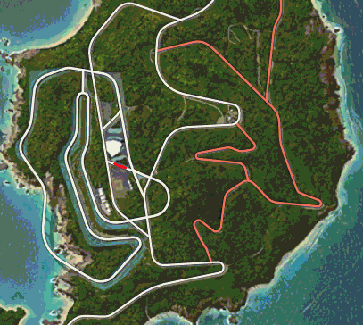

> **DISCLAIMER:** This tool is NOT meant to ruin the fun of exploring — it's meant to save your sanity when you're stuck at 99% roads discovered and can't find that last tiny segment!

# FH6 Screenshot Road Finder

**[Try it live](https://thisisskay.github.io/fh-road-finder-web/)**

A free, browser-based tool that helps you find the last few undiscovered roads in Forza Horizon 6.

Upload, drop, paste, or load a map screenshot from a URL and the tool instantly highlights any pixels matching the undiscovered-road grey. Zoom in, pan around, change colours, and adjust tolerance — all live, no page reload needed.

**No installation. No server. No sign-up. Your images never leave your browser.**

## Why This Tool Matters

When you are stuck at 99% roads discovered, the missing piece can be a tiny grey segment hiding under icons, trees, or map texture. FH Road Finder helps narrow the search by highlighting pixels close to the undiscovered-road colour, so you spend less time sweeping the whole map and more time checking likely spots.

## Compatibility And Screenshot Disclaimer

This tool was built for **Forza Horizon 6** map screenshots. It might not work on **Forza Horizon 1 to Forza Horizon 5** because older games can use different map colours, UI layouts, compression, and road rendering. If enough players ask for earlier-game support, I may add support later.

Use direct in-game screenshots only. **Phone photos of a TV or monitor cannot be scanned by this tool** because camera processing, glare, angle, blur, screen pixels, and colour shifts break the exact grey-pixel detection. PNG screenshots are best. JPEG can work if it is a direct game screenshot, but it may need tolerance 5 or 8.

## Example Result

This example uses a PNG map screenshot with:

- Tolerance: **1 (Strict)**
- Line thickness: **2 px**
- Min cluster: **4 px**
- Cycle highlight colours: **On**

| Before | After: animated overlay | After: animated black background |
|--------|-------------------------|----------------------------------|
|  |  |  |

The animated GIFs show the cycling highlight effect in the tool's **Overlay** and **Black** output modes. For very small missing roads, increase **Line thickness** to make detections easier to spot.

## How It Works

1. Open the tool in any modern browser (Chrome, Edge, Firefox).
2. Choose a file, drag and drop it, paste it with Ctrl/Cmd+V, or enter a direct PNG/JPEG/WebP URL.
3. The tool scans every pixel for the undiscovered-road grey (RGB 128, 128, 128) and highlights matches instantly.
4. Adjust tolerance, highlight colour, line thickness, and output mode — the view updates in real time.
5. Zoom in and pan around to find small road segments.
6. Download the result as PNG.

## Features

- **Live scanning** — results update as you adjust settings, no button clicks needed.
- **Flexible image input** — choose a file, drag and drop, paste a screenshot, or load a direct PNG/JPEG/WebP URL.
- **Zoom and pan** — scroll to zoom into any area, drag to pan. Use the 1:1 button to see actual pixels.
- **Line thickness** — dilate detected pixels so even a single-pixel match becomes a visible dot.
- **Multiple highlight colours** — red, green, yellow, cyan, magenta, orange, white, or pick any custom colour.
- **Colour cycling** — optionally animate the highlight colour and adjust its speed so tiny detected roads stand out while scanning the map.
- **Three output modes** — Overlay (highlights on original image), Black (highlights on black background, easiest to scan), and Transparent (for layering).
- **Works with direct PNG and JPEG screenshots** - PNG gives the most accurate results. JPEG compression shifts colours, so use tolerance 5 or higher.

## Privacy

All processing runs locally in the browser using JavaScript and the Canvas API. Uploaded and pasted images are never uploaded and the tool works fully offline after the page loads.

Loading an image URL makes a direct request from your browser to the source host. That host must allow cross-origin (CORS) access. If it blocks the request, download the image and upload or paste it instead.

## Default Settings

The tool starts with exact grey matching and a small visibility boost:

- Tolerance: **0 (Ultra strict)**
- Line thickness: **2 px**
- Cycle highlight colours: **On**
- Min cluster: **3 px**

## Tolerance Guide

Tolerance controls how close a pixel must be to the target grey to count as a match. Each colour channel (R, G, B) is checked independently.

| Value | Name | Use case |
|-------|------|----------|
| 0 | Ultra strict | Exact match only. Clean PNG screenshots. |
| 1–2 | Strict / Normal | Small margin. Good for PNG. |
| 5 | Loose | Start here for JPEG screenshots. |
| 8+ | Very loose | Catches more but includes false positives. |

JPEG compression shifts pixel colours, so a pixel that was exactly (128, 128, 128) in-game may become (126, 129, 127) in a JPEG file. Higher tolerance compensates for this.

## Compatibility

This tool was built and tested for **Forza Horizon 6**. Forza Horizon 1 to Forza Horizon 5 are not supported right now and may not scan correctly. The target colour can be changed under Advanced settings if needed, but earlier-game support would need real screenshots and player testing.

## Technical Notes

- Pure HTML, CSS, and JavaScript. No frameworks, no build step, no dependencies.
- Optimised for screens from 1080p to 4K, including ultrawide displays up to 32:9.
- Works locally by opening `index.html` directly, or hosted on any static web server including GitHub Pages.

## Legacy Windows CLI

The earlier BAT + Python workflow is preserved in
[`legacy-windows-cli`](legacy-windows-cli). It supports local batch processing,
multiple tolerance passes, generated PNG masks, and an HTML report.

## Credits

Built for the Forza Horizon 6 community. Open source, no tracking, no ads.
